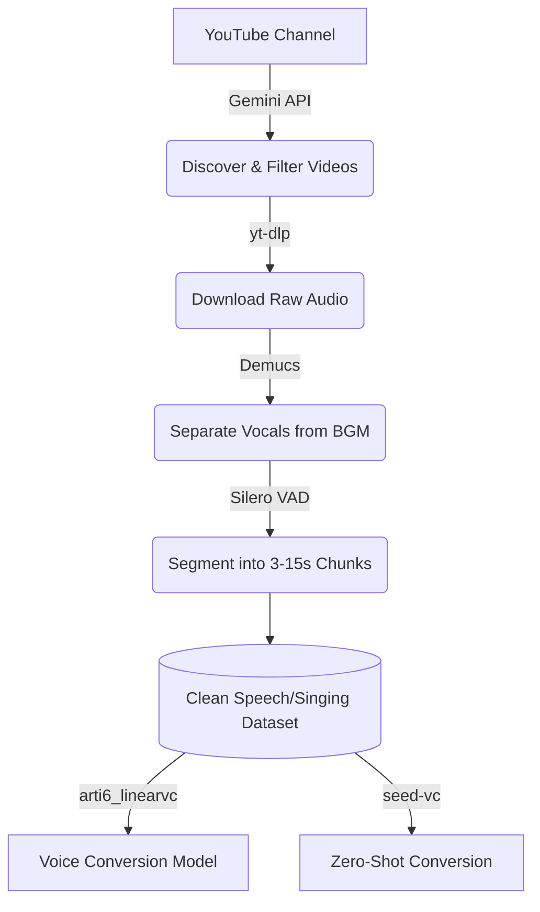

<div align="center">
  <h1>🎙️ VTuber Voice Curation & Conversion Pipeline</h1>
  <p>An automated end-to-end Machine Learning pipeline for building high-quality voice conversion datasets from raw YouTube streams.</p>
  <a href="https://0hickenduck.github.io/arti6_linearvc"><b>View Interactive Demo Page</b></a>
</div>

<br/>

## 📖 Overview

Manual audio curation for voice conversion (VC) and text-to-speech (TTS) models takes hundreds of hours. You have to download videos, separate the background music, manually slice the audio into clean phonetic chunks, and discard bad data.

This project **automates the entire workflow**. It provides:
1. **`vtuber_pipeline`**: An automated data engine that discovers, downloads, purifies (BGM removal via Demucs), and segments (Silero VAD) raw VTuber streams into pristine 3-15s audio chunks.
2. **`arti6_linearvc_demo`**: A Voice Conversion research pipeline investigating Articulatory features (ARTI-6) and zero-shot voice conversion using Seed-VC.

## 🏗️ Architecture



## ✨ Key Features

- **LLM-Powered Discovery**: Uses Gemini Flash to analyze YouTube channel feeds, intelligently filtering out collab streams and separating `Speech` (Zatsudan) from `Singing` (Karaoke).
- **Automated Source Purification**: Uses [Demucs](https://github.com/facebookresearch/demucs) to mathematically strip away background game audio, BGM, and sound effects.
- **Smart Voice Activity Detection**: Uses [Silero VAD](https://github.com/snakers4/silero-vad) to intelligently slice continuous streams into ML-ready phonetic chunks without cutting words in half.
- **Voice Conversion Sandbox**: Built-in support for evaluating the dataset against ARTI-6 models and Seed-VC for timbre-shifting and singing voice conversion.

## 🚀 Quick Start

### 1. Data Curation (`vtuber_pipeline`)

To run the automated agent that pulls from a channel and builds a dataset:

```bash
# Install dependencies
pip install yt-dlp google-genai pydantic torch torchaudio

# Set your Gemini API key for smart discovery
export GEMINI_API_KEY="your_api_key_here"

# Run the pipeline
python3 vtuber_pipeline/src/local_agent.py "https://www.youtube.com/@TargetChannel" --max-videos 20
```

### 2. Voice Conversion (`arti6_linearvc_demo`)

To evaluate a minimal Voice Conversion smoke test using the curated datasets:

```bash
.venv/bin/python arti6_linearvc_demo/run_arti6_smoke.py \
  --wav external/arti-6/example_gt.wav \
  --output-dir outputs/smoke/example
```

## 📂 Project Structure

- `/vtuber_pipeline`: The data engineering pipeline (discovery, download, Demucs, VAD).
- `/arti6_linearvc_demo`: ML experiment code, dataset preparation scripts, and Seed-VC/ARTI-6 integration.
- `/docs`: Frontend assets for the showcase demo page.

## 👨‍💻 Author
**Bowen** - [GitHub](https://github.com/0hickenduck)
