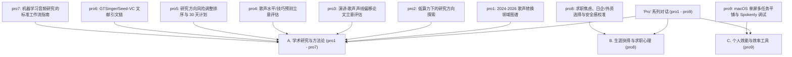

# ⚙️ 仓库内 "Pro" 系列对话记录分类与摘要 (Pro Chats Digest)

本文件是对您在仓库中记录的 `pro1` 到 `pro9` 系列深度对话的整理与汇总。这 9 次对话是您（东大 EEIS M1 学生，语音/AI 方向）在学术研究、职业规划以及日常效能工具使用中，与 AI 助手进行的深度对齐和方案探讨。

---

## 📌 顶层分类概览 (Top-Level Categorization)

通过分析这 9 个文件的内容，可以将其划分为三个清晰的主题维度：

---

## 📂 详细摘要与关键结论

### 🔬 维度 A：学术研究与方法论 (Academic Audio Research & Methodology)
该维度包含 **pro1 至 pro7**，全面覆盖了从宏观领域调研、具体立意评估、算力性价比排序，到引文链梳理和科研方法论落地的全过程。

#### 1. [pro1_speech_singing_field_map.md](file:///Users/bowen/Library/CloudStorage/GoogleDrive-0hickenduck@gmail.com/Other%20computers/我的笔记本电脑/Obsidian%20Vault/Tech_Workspace/Research_Notes/_sources/pro1_speech_singing_field_map.md)
*   **核心内容**：梳理 2024–2026 年歌声转换 (SVC)、歌声风格转换、说话声-歌声转换 (Speech-to-Singing) 以及跨语言音色解耦与音频表征分解的领域学术图谱。
*   **关键结论**：明确了 zero-shot 歌声转换和基于音频 Codec/SSL（自监督学习）的解耦是当前前沿；指出了多模态音频表征在控制音色与内容时的泄露问题是研究热点。

#### 2. [pro2_speech_singing_research_advisor.md](file:///Users/bowen/Library/CloudStorage/GoogleDrive-0hickenduck@gmail.com/Other%20computers/我的笔记本电脑/Obsidian%20Vault/Tech_Workspace/Research_Notes/_sources/pro2_speech_singing_research_advisor.md)
*   **核心内容**：在“仅有几张 GPU、无法训练大基座模型”的客观算力约束下，探索新颖且可行的硕士研究方向。
*   **关键结论**：建议将目光从“追求极致效果的转换模型训练”转向“同一人说话声与歌声之间的声线/音色身份偏移量化与控制”，避免在算力上与工业界硬碰硬。

#### 3. [pro3_voice_representation_idea_review.md](file:///Users/bowen/Library/CloudStorage/GoogleDrive-0hickenduck@gmail.com/Other%20computers/我的笔记本电脑/Obsidian%20Vault/Tech_Workspace/Research_Notes/_sources/pro3_voice_representation_idea_review.md)
*   **核心内容**：评估一个具体设想：“同一人说话和唱歌时的音色偏移”。假设说话人身份并非静态 embedding，而是“稳定身份核心 + 说话/唱歌模式相关的残差 (vocal-mode residual)”。
*   **关键结论**：该设想被评为可行，但警告必须小心“音高 (F0)、能量和音素时长”等混淆变量，不能把简单的基频不同错当成身份残差。

#### 4. [pro4_singing_skill_prediction_review.md](file:///Users/bowen/Library/CloudStorage/GoogleDrive-0hickenduck@gmail.com/Other%20computers/我的笔记本电脑/Obsidian%20Vault/Tech_Workspace/Research_Notes/_sources/pro4_singing_skill_prediction_review.md)
*   **核心内容**：评估第二个备选方向：“自动歌声技巧/歌唱水平预测与评估（如预测普通人训练后会变成什么声音）”。
*   **关键结论**：该方向难度极大且存在主观性漏洞。若无大量经过人工黄金标准标注的歌声水平数据集，容易变成无意义的回归拟合；建议将其降级为研究的支撑部分而非核心。

#### 5. [pro5_research_direction_ranking.md](file:///Users/bowen/Library/CloudStorage/GoogleDrive-0hickenduck@gmail.com/Other%20computers/我的笔记本电脑/Obsidian%20Vault/Tech_Workspace/Research_Notes/_sources/pro5_research_direction_ranking.md)
*   **核心内容**：对前述所有备选方向进行风险调整排序（包含新颖度、可行性、数据代码开源情况、发表机会等），并给出首发实验和 30 天计划。
*   **关键结论**：
    *   **首选方向**：同一人说话-歌声声线偏移（探究音色身份在模式切换时的留存以及对 zero-shot SVC 失败的预测）。
    *   **备选方向**：基于 GTSinger/VocalSet 的歌唱技巧方向发现与控制。
    *   **本周行动**：提取 JVS/JVS-MuSiC 同一人在说话和唱歌时的 frozen SSL/Codec 表征，运行线性探针 (Linear Probing)，检查分类器能否完美拆分说话/唱歌模式。

#### 6. [pro6_literature_citation_chain.md](file:///Users/bowen/Library/CloudStorage/GoogleDrive-0hickenduck@gmail.com/Other%20computers/我的笔记本电脑/Obsidian%20Vault/Tech_Workspace/Research_Notes/_sources/pro6_literature_citation_chain.md)
*   **核心内容**：围绕 `GTSinger`、`Seed-VC`、`FACodec`、`SVCC 2025` 等学术支点进行双向文献引文链追踪。
*   **关键结论**：详细梳理了零样本语音转换、Codec 表征学习和歌声质量主客观评测的学术演进脉络，标明了每个工具和数据集在您的研究中应当扮演的角色（如 GTSinger 作为技巧标签源，Seed-VC 作为下游介入验证工具）。

#### 7. [pro7_ml_audio_research_workflow.md](file:///Users/bowen/Library/CloudStorage/GoogleDrive-0hickenduck@gmail.com/Other%20computers/我的笔记本电脑/Obsidian%20Vault/Tech_Workspace/Research_Notes/_sources/pro7_ml_audio_research_workflow.md)
*   **核心内容**：以“同一人说话-歌声身份偏移”为具体案例，系统讲解机器学习与音频研究的标准严谨工作流。
*   **关键结论**：涵盖了科研立意精细化、文献扫描、防混淆变量设计（例如在测试音色偏移时必须在相同音素和音高段上做对照）、Baseline 选择、消融实验规划、以及何时引入人类主观听感评测（Listening Test），并给出了可复用的科研清单模板。

---

### 💼 维度 B：生涯抉择与求职心理 (Career Strategy & Psychology)

#### 8. [pro8_career_life_exposure_dialogue.md](file:///Users/bowen/Library/CloudStorage/GoogleDrive-0hickenduck@gmail.com/Other%20computers/我的笔记本电脑/Obsidian%20Vault/Career/_sources/pro8_career_life_exposure_dialogue.md)
*   **核心内容**：面对东大 M1 第一学期刚开始时的同辈压力、求职方向（外资 vs 日企、IT 算法 vs 开发）、对日企职场霸凌的焦虑，以及“知道该做什么但迈不出第一步”的拖延心理。
*   **关键结论**：
    *   **降级身份威胁**：“不知道自己水平在哪”往往是一种维持心理安全感的逃避方式。应将哲学性质的“本质追问”翻译成**“可承受的暴露训练”**（如每天限时做题、每周固定投递 3 家并直面反馈）。
    *   **理性校准安全感**：将抽象的财务焦虑具象化为一张**“安全感数据表”**（包括东京最低生活成本、家庭应急金、底线年收等具体数字），避免无休止的“高薪”内卷。
    *   **去小红书化**：不应依靠社交平台的情绪化故事来对日企或外资下定义，而应通过说明会提问、OB/OG 访谈，验证具体公司的“Hard No”（如客先常驻、强制饮酒）和“Hard Yes”（自社产品、能英语交流、重视个人时间）。

---

### 🛠️ 维度 C：个人效能与效率工具 (Productivity & Life Engineering)

#### 9. [pro9_mac_spokenly_workflow_dialogue.md](file:///Users/bowen/Library/CloudStorage/GoogleDrive-0hickenduck@gmail.com/Other%20computers/我的笔记本电脑/Obsidian%20Vault/Life_Engineering/Meta/_sources/pro9_mac_spokenly_workflow_dialogue.md)
*   **核心内容**：解决 MacBook Air 单屏下多开窗口频繁切换导致的“视觉搜索摩擦”，以及 Spokenly 听写软件在特定模型设置下首次识别与 Retry 识别不一致的 Bug 排查。
*   **关键结论**：
    *   **窗口切换工程化**：不要让窗口无序堆叠，应改用**“Space 寻址法”**。创建 5 个固定任务桌面的 Space（如 Code、Reference、Research、Inbox、Notes），在系统设置中启用 `Control + 1/2/3/4/5` 的直接跳转热键。
    *   **推荐效率工具**：推荐使用 **Rectangle**（平铺管理器）实现键盘化二分屏，以及安装 **AltTab for macOS** 实现 Windows 风格的窗口级切换，降低对鼠标拖拽的依赖。
    *   **Spokenly Bug 诊断**：指出了软件可能在 Dictation 快捷触发时读取了缓存/默认配置（ElevenLabs/ByteDance），而在 History Retry 时重新从 settings payload 构造了正确的模型请求。

---

## 💡 共通的方法论内核

贯穿这 9 次对话的核心思维方式可以总结为：**“将抽象虚无的本质问题，重写为具体的工程/暴露问题。”**
无论是面对深奥的学术立意、难以迈步的求职拖延，还是混乱的单屏桌面，最有效的方式都是通过引入**物理寻址、数字量化、控制混淆变量和设置底线反馈**来打破焦虑壁垒。
