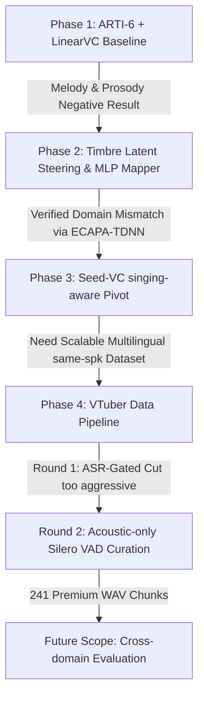

# 🎤 Multilingual Voice Conversion & Cross-Domain Timbre Shift: Mid-Term Research Handoff Report
## 中期研究与数据管线交接报告（从 ARTI-6 负结果到 Seed-VC 与 VTuber 净化管线）

> [!NOTE]
> 本文档旨在为未来的 **AI Agent** 和 **人类研究员** 提供本项目的完整技术脉络与架构鸟瞰。
> 阅读本文档可帮助您在 **3分钟内** 快速建立对整个项目的 Context 理解，避免消耗数万 Token 去通读所有底层脚本和历史日志。

---

## 🧭 项目愿景与研究方向 (Core Research Scope)

本项目的核心目标是探索**同人跨语种（Multilingual, EN/JP）**以及**同人跨领域（Cross-Domain, 说话 Speech vs. 唱歌 Singing）**在语音合成与声音转换（Voice Conversion, VC）中的**音色偏差（Timbre Shift）与鲁棒性**。

具体而言，我们研究当同一位说话者（例如多语种 VTuber）在说英语、说日语、进行非正式唱歌（Karaoke）以及正式歌曲演唱（MV）时，其声学特征、声带振动模式和表征音色的 Speaker Embedding 是如何发生偏移的，以及如何利用现代 VC 模型实现高保真的跨领域音色转换。

---

## 🗺️ 研究演进脉络 (Chronological Journey)

整个项目的研发经历了一个清晰的“探索-试错-转向-数据工程”的闭环：



### 1. Phase 1: ARTI-6 + LinearVC 探索（起点与负结果）
*   **最初设想**：基于发音器官参数（Articulatory Features）的线性变换进行声音转换。
*   **技术路径**：通过线性或浅层映射尝试重建目标音色。
*   **核心结论（Negative Result）**：
    *   ARTI-6 目标重建无法保留说服力强的唱歌旋律（Melody）与韵律（Prosody）。
    *   在隐空间中移动 Embedding 虽有数学效果，但在声学上，ARTI-6 解码器无法呈现出感官明显的歌唱音色变化。
    *   最终合成效果听起来像是被拉伸拉长的、带说话腔调的机械发音，而非真实的歌唱。
*   **学术转向**：放弃在发音器官线性参数上的纠缠，转向**端到端表征学习（Representation Learning）**和**歌唱感知的神经解码器（Singing-Aware Decoders）**。

### 2. Phase 2: 隐空间音色控制与领域失真验证（数学论证）
为了验证“跨领域音色偏差”是一个真实存在且有学术价值的科学问题，我们开展了隐空间映射与客观识别率衰减测试：
*   **音色操控实验 (Timbre Steering)**：
    *   **Route A (Latent Steering Slider)**：计算同一发言人 Speech 与 Singing 均值的差值作为偏移向量，在推理时进行线性插值操控。
    *   **Route B (Micro-Mapper MLP/Transformer)**：设计小型多层感知机/Transformer，从说话 Embedding 预测歌唱 Embedding。
    *   **GTSinger 数据集验证**：以同一歌手 `EN-Alto-1` 进行 Round-Robin 留一验证，Route A 操控将余弦相似度（Cosine Similarity）从原始 of `0.6516` 提升到了 `0.7364`。
*   **客观声纹识别衰减测试 (Speaker Recognition Degradation)**：
    *   我们使用现代声纹识别器（SpeechBrain ECAPA-TDNN）测试同一人在跨领域时的声纹认同度。
    *   **Speech Enroll ➡️ Speech Query**：Speaker ID 准确率 `95.0%`，等错误率 (EER) `0.024`。
    *   **Speech Enroll ➡️ Singing Query**：Speaker ID 准确率暴跌至 `70.0%`，等错误率 (EER) 飙升至 `0.125`。
    *   **科学结论**：跨领域（说话 vs. 歌唱）的声纹偏差客观存在，且对现代声纹识别系统造成了极强的扰乱。这为后续音色控制研究确立了扎实的基石。

### 3. Phase 3: Seed-VC 解耦解码器引入（技术突破）
为了实现真正的歌唱高保真转换，我们引入了领先的零样本声音转换框架 **Seed-VC**（克隆至 `external/seed-vc`）：
*   **技术机制**：实现源内容/旋律（Content/Melody）与目标音色 Prompt（Timbre Prompt）的彻底解耦。
*   **实验验证**：以真实歌唱作为 Source Melody，分别以目标人的 Speech 录音和 Singing 录音作为 Timbre Prompt。
*   **核心发现**：使用 Singing Reference 作为 Prompt时，转换音色与原唱歌手的相似度最高（余弦增益均值 `0.439`）；而使用 Speech Reference 依然能成功引导模型转换出目标的歌唱音色，证明了通过说话录音跨领域控制歌唱音色的可行性。

### 4. Phase 4: VTuber 净化与数据管线构建（数据提取尝试）
由于 GTSinger 等公开学术数据集在 VTuber/多语种歌喉的多样性上严重不足，我们决定自主摄取互联网上多语种 VTuber 的高保真音质数据。我们经历了两个核心轮次的探索：

*   **Round 1 (初始尝试 - 效果不佳)**：
    *   由于依赖了 Whispher 等 ASR（自动语音识别）文本的存在作为分段门限，导致大量高价值但“无歌词文本”（如哼唱、长音拉伸、呼吸声、垫音等）的艺术歌唱片段被粗暴过滤。
    *   同时，分段过于零碎，未能抓取到适合训练的“甜点时长”（3-15秒完整句子）。
*   **Round 2 (当前状态 - 声学VAD保守净化)**：
    *   **架构升级**：编写了全新的无 Manifest 目录感知脚本 [`process_polyglot.py`](file:///home/bowen/bowen_lab/projects/arti6_linearvc/vtuber_pipeline/src/process_polyglot.py)，使整个流程可以直接在 GPU 服务器端对嵌套目录执行全自动处理。
    *   **算法升级**：编写了基于物理声学 and Silero VAD 的 [`curate_existing_audio.py`](file:///home/bowen/bowen_lab/projects/arti6_linearvc/vtuber_pipeline/src/curate_existing_audio.py) 脚本。
    *   **降噪除噪**：使用 Demucs 极致剥离背景伴奏（BGM）和噪音，仅保留人声干声 Stem，再使用 Silero VAD 进行短时长的语义合并，精准输出 3-15 秒的“甜点区”音频块。
    *   **三色分桶安全策略**：为了保证训练集纯净度，我们设计了精密的分类器，将切片数据分流至三个不同的目录：
        1.  `clean_candidate/`（纯净训练集）：背景声剥离彻底、发音清晰、单发言人的超高保真音频。
        2.  `review/`（需二次校验）：时长较长或 Mori 等可能存在多人聊天杂音的音频，需声纹聚类/人声分离（Diarization）后使用。
        3.  `quarantine/`（隔离区）：已知存在多人重叠声音或双胞胎共同发言（如 FuwaMoco Twins 音频，因声音重叠特征高度相似，为了避免声纹污染而强力隔离）。

---

## 📂 核心目录与代码蓝图 (Directory Blueprint)

当前项目的物理和逻辑架构如下，方便未来 Agent 快速定位对应资产：

```text
/home/bowen/bowen_lab/projects/arti6_linearvc/
├── .trellis/                           # Trellis 规范与任务管理中心 (Trellis Gov)
│   ├── spec/                           # 各模块的技术契约和开发规范
│   │   ├── repo-structure.md           # 软空间拆分与大文件脱敏规范
│   │   └── vtuber_pipeline/            # VTuber 管线专属规范（含非压缩本地预览政策）
│   └── tasks/archive/                  # 历史归档的开发任务记录 (极具回溯价值)
├── vtuber_pipeline/                    # 🎤 本地 VTuber 数据处理核心管线 (Active)
│   ├── src/
│   │   ├── process_polyglot.py         # [NEW] 嵌套目录无缝迭代处理 Wrapper 脚本
│   │   ├── curate_existing_audio.py    # [CORE] 声学 VAD 保守切片与三色分桶脚本
│   │   ├── purify_audio.py             # 底层 Demucs (伴奏剥离) + Silero VAD 精密净化库
│   │   └── discover_videos.py          # LLM 驱动的 YouTube 视频 Speech/Singing 分类器
│   ├── HANDOFF.md                      # 本地运行和工具环境配置的详细 Handoff 指引
│   └── README.md                       # 说明书，已更新推荐现有 WAV 净化流而非 legacy 压缩流
├── projects/
│   └── vtuber_voice/               # 📈 VTuber 语料进度与后续切分轨迹
│       ├── progress.md                 # 当前数据产出的统计与详细特征
│       └── README.md                   # 记录数据处理原则与本地生成大文件防泄露规则
├── docs/
│   └── repo_sync.md                    # 🔄 仓库数据多机同步与 rsync 传输命令行指引
└── data/ (Git Ignored)                 # ⚠️ 本地生成的大音频文件，已全隔离在 Git 外
    ├── raw_audio/                      # 原始下载或上传的 raw wav
    ├── temp_demucs/                    # 剥离 BGM 生成的 vocals wav 缓存
    └── vtuber_curated_conservative_20260524_run2/ # 最新一轮净化分桶输出的 Expanded 数据目录
```

---

## 📊 数据指标看板 (Latest Dataset Statistics)

截至最新的 **Round 2 (2026-05-24)** 运行结果，VTuber 保守净化管线成功处理了 **51 个大 WAV 语音源（约 26.5 小时）**，生成了 **241 个极高品质切片**：

*   **输出路径**：`data/vtuber_curated_conservative_20260524_run2/` (体积为 379M)
*   **切片总数**：241 个 WAV 段，时常介于 **3.10 到 15.00 秒** 之间（均值 **9.310 秒**，完美契合训练甜点期）。
*   **状态分桶详情**：

| 分桶状态 (Status) | 数量 (Count) | 归档细分 (Breakdown) | 核心特征与处理意见 |
| :--- | :---: | :--- | :--- |
| **`clean_candidate`** | **92** | <ul><li>Enna/EN_Singing: 43</li><li>Kiara/EN_JP_DE_Talking: 6</li><li>Kiara/EN_Singing: 28</li><li>Mori/EN_JP_Singing: 15</li></ul> | **最高纯净度**。完全可以直接送入 VC 模型（如 Seed-VC）进行训练。 |
| **`review`** | **101** | <ul><li>Enna/EN_Talking: 10</li><li>Mori/EN_JP_Talking: 91</li></ul> | **高纯度，但存在杂音隐患**。多为长时间的 Talking 直播切片，需进一步使用声纹验证/Diarization 剔除多人协作谈话的杂音。 |
| **`quarantine`** | **48** | <ul><li>FuwaMoco/EN_JP_Singing: 48</li></ul> | **被隔离的双人重叠音轨**。FuwaMoco 组合合唱重音严重，放入单人训练集将导致音色污染，建议只用于后续合唱分离或双声部专项研究。 |

---

## 🚀 后续开发路线与交接指南 (Roadmap for Next AI Agent)

如果您是刚接手本仓库的 **新 AI 助手**，请遵循以下开发指南：

1.  **验证当前数据质量**：
    *   在服务器端直接预览 `data/vtuber_curated_conservative_20260524_run2/clean_candidate/` 下的音频，注意聆听 Enna 与 Mori 的 Singing 表现，验证伴奏剥离程度。
    *   注意：根据我们的 **非压缩预览政策**，切勿自作主张将该目录压缩成 `.tar.gz` 或 `.zip`，必须保持扩展的明文目录结构以供 Bowen 主管进行 Web 端直接试听。
2.  **处理 `review/` 分桶**：
    *   为了将 Mori 的 91 个 Talking 切片转化为 Clean Candidate，您可以编写一个简单的轻量声纹提取与验证器，提取每个切片的 ECAPA-TDNN 声纹，利用聚类或相似度门限，把 Mori 单人说话的纯净片段筛选出来。
3.  **运行 Seed-VC 进行跨领域转化实验**：
    *   利用 `external/seed-vc` 模型，将 `clean_candidate/` 中 Enna 和 Mori 纯净的歌唱作为 Source 音轨，输入不同语种（比如 Kiara 说话的 Speech）作为 Timbre Prompt，生成跨领域的歌声转换试听样本。
4.  **遵循 Trellis 规范**：
    *   开始编写新代码前，请务必调用并阅读 `.agents/skills/trellis-before-dev/SKILL.md`，并在编写完后调用 `.agents/skills/trellis-check/SKILL.md` 进行规范校验。
